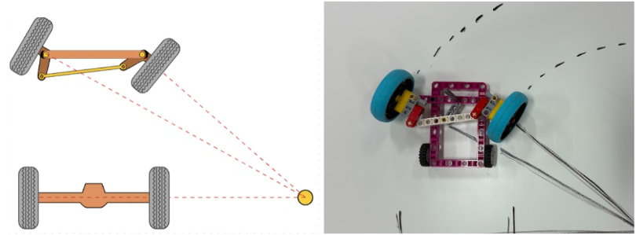

# The Team

We are the Blue Lobsters, Niva, Jeevesh and Shadya. We are united by a passion for STEM, Electronics, coding and jalapeño poppers. We wanted to bring our jouney to many other with the same passions and inspire teenagers around the world. To us its more than just coding or building, its the experiences and connections along the way. 

Team Blue Lobsters is us, Niva, Jeevesh and Shadya came together as a team and found that we have a common passion. We not only like technology but we also believe that technology in the right hands will do abundant good. So, we not only want this to be a technical documentation, we want this as an inspiration and a blue-print for people like us to learn and enjoy technology. The competition is just an outcome, but we want this to be an amazing experience in the first place. Join us on this journey.

---
# The Robot

Our robot is called *Jadoo* which means magic in Hindi. The name comes from a popular movie character who is also an alien and can do *Jadoo*. The drive base of our robot kind of looked like an alien head, so we named it after our favourite alien character. 

## Robot images

Markdown makes it easy to format text. You can write in **bold**, *italic*, or ~~strikethrough~~. Combine them for ***bold italic*** text. Use `inline code` for technical terms.

# Mobility Management
To build a self-driving car we need to build a car. 

Build objectives:

- As per the rules, the car must have a steering mechanism and the rear axle driven by a motor. 
- Our team also wanted the car to be stable and fast (and colorful if we can help it). 

Chassis: 

Steering:

Drive Motor
